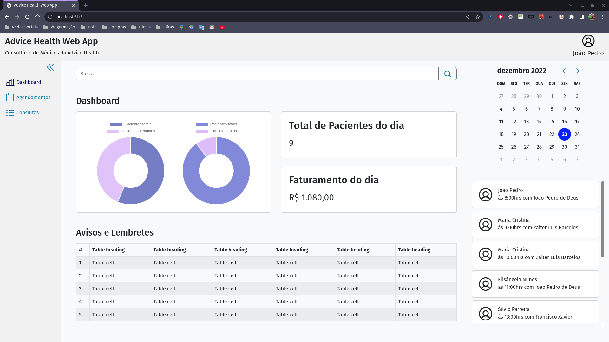
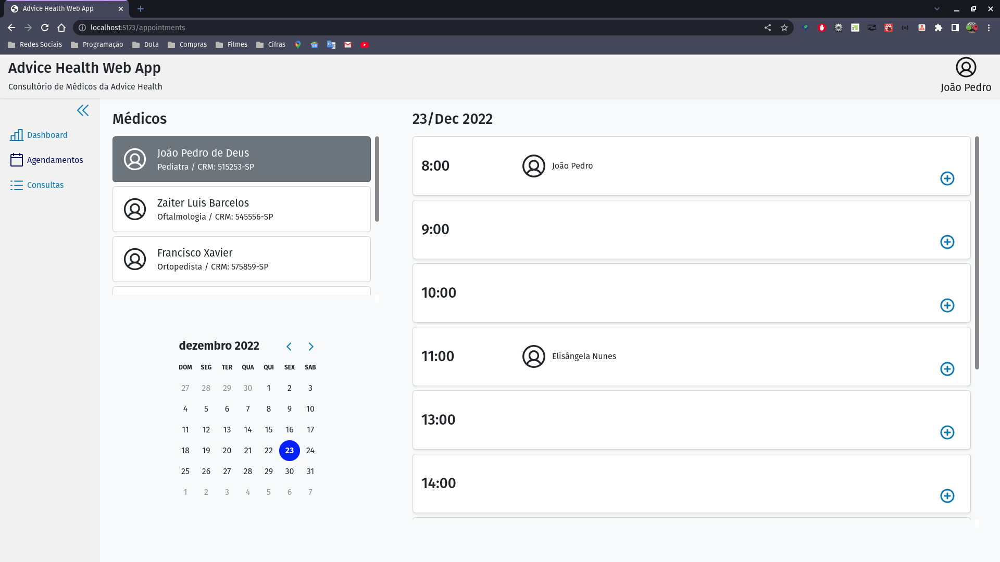
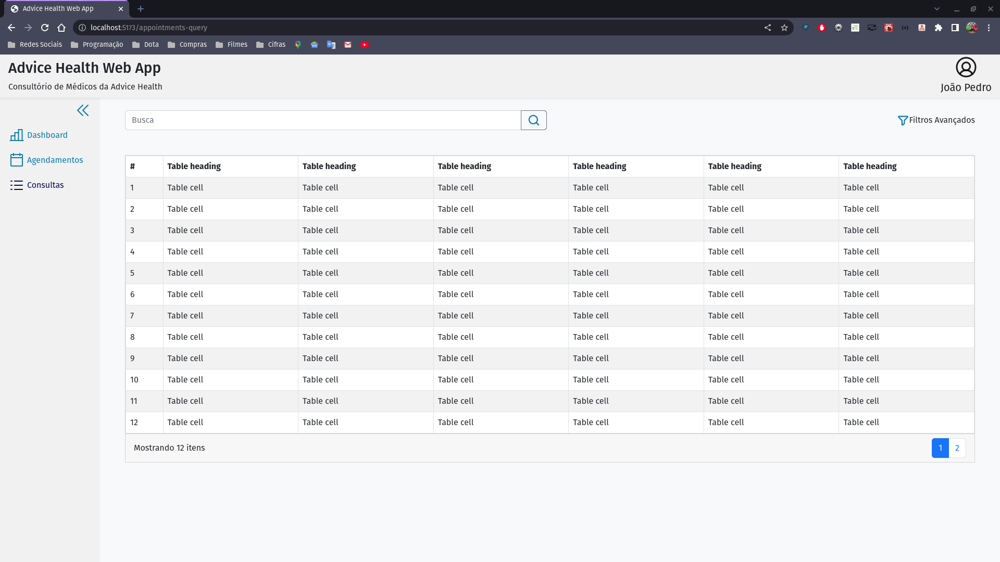

<h1 align="center"> Advice Health Web App </h1>

Just a challenge.

  <a href="#-tecnologias">Technologies</a>&nbsp;&nbsp;&nbsp;|&nbsp;&nbsp;&nbsp;
  <a href="#-projeto">Project</a>&nbsp;&nbsp;&nbsp;|&nbsp;&nbsp;&nbsp;
  <a href="#-preview">Preview</a>&nbsp;&nbsp;&nbsp;|&nbsp;&nbsp;&nbsp;
  <a href="#memo-licença">License</a>

  

 

## 🚀 Technologies

Esse projeto foi desenvolvido com as seguintes tecnologias:

- [ReactJS](https://beta.reactjs.org/)
- [Typescript](https://www.typescriptlang.org/)
- [Bootstrap](https://getbootstrap.com/)
- [React-Bootstrap](https://react-bootstrap.netlify.app/)
- [Axios](https://axios-http.com/docs/intro)
- [date-fns](https://date-fns.org/)
- [chart-js](https://www.chartjs.org/)
- [react-chartjs-2](https://react-chartjs-2.js.org/)
- [react-day-picker](https://react-day-picker.js.org/)
- [phosphor-icons](https://phosphoricons.com/)
- [Node e NPM](https://nodejs.org/)
- [Vite](https://vitejs.dev/)

## 💻 Project

Clonar esse repositório

> $ cd advice-health-web-app
>
> $ npm install

Entre no arquivo server.json e verifique se os valores de date correspondem ao dia atual e ao próximo dia.

> $ npm run server
>
> $ npm run dev

## Preview

  

  

  

## :memo: License

This project is on MIT license.

---

Made with ♥ by jp-freitas :wave:
